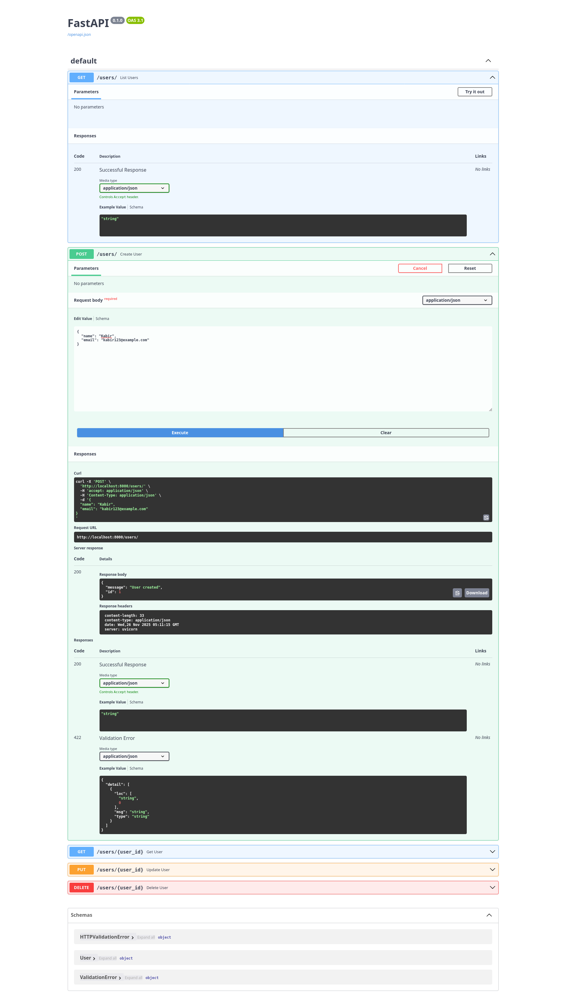
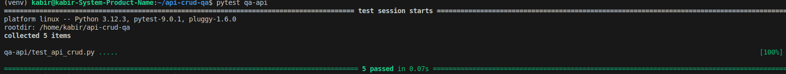
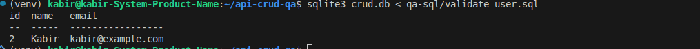

# 📌 **API CRUD QA Framework**

A complete end-to-end QA Engineering project demonstrating **REST API testing**, **automation**, **database validation**, **negative testing**, and **CI/CD integration** using **FastAPI, pytest, requests, and SQLite**.

<p align="center">
  
</p>

---

# 🧾 **Overview**

This project provides a basic CRUD (Create, Read, Update, Delete) REST API for user management.
The purpose is to build a **real-world QA automation framework** around the API:

* ✔ Functional API testing
* ✔ Negative & edge-case testing
* ✔ SQL database validation
* ✔ Manual test cases
* ✔ Bug reports
* ✔ CI/CD with GitHub Actions
* ✔ Linux-based QA setup

This repository is ideal for demonstrating QA automation skills for any backend-focused QA role.

---

# 🧱 **Tech Stack**

| Layer          | Tools                    |
| -------------- | ------------------------ |
| Backend API    | FastAPI, Uvicorn, SQLite |
| API Automation | pytest, requests         |
| SQL Validation | sqlite3                  |
| CI/CD          | GitHub Actions           |
| Documentation  | Markdown, Excel          |

---

# 📂 **Project Structure**

```
api-crud-qa/
│
├── backend/
│   └── main.py
│
├── qa-api/
│   └── test_api_crud.py
│
├── qa-sql/
│   └── validate_user.sql
│
├── qa-manual/
│   ├── test-cases.xlsx
│   └── bug-reports.xlsx
│
├── screenshots/
│   ├── api_tests_passed.png
│   ├── sql_output.png
│   ├── endpoint_testing.png
│   └── db_validation.png
│
├── .github/
│   └── workflows/
│       └── run-tests.yml
│
└── README.md
```

---

# ⚙️ **Setup Instructions (Linux)**

## 1️⃣ Create & activate virtual environment

```bash
python3 -m venv venv
source venv/bin/activate
```

## 2️⃣ Install dependencies

```bash
pip install fastapi uvicorn sqlalchemy pytest requests
```

## 3️⃣ Run the backend server

```bash
uvicorn backend.main:app --reload
```

API is available at:
👉 [http://localhost:8000](http://localhost:8000)

---

# 🧪 **API Automation (pytest + requests)**

Run all automated tests:

```bash
pytest qa-api
```

### 📸 API Test Screenshot



---

# 🗄 **Database Validation (SQLite)**

Check database records:

```bash
sqlite3 crud.db < qa-sql/validate_user.sql
```

### 📸 SQL Output



---

# 🔍 **API Endpoints**

| Method | Endpoint      | Description       |
| ------ | ------------- | ----------------- |
| POST   | `/users/`     | Create a new user |
| GET    | `/users/`     | List all users    |
| GET    | `/users/{id}` | Get user by ID    |
| PUT    | `/users/{id}` | Update user by ID |
| DELETE | `/users/{id}` | Delete user by ID |

---

# 💻 Example JSON

### **Create User**

```json
{
  "name": "Kabir",
  "email": "kabir@example.com"
}
```

### **Update User**

```json
{
  "name": "Kabir Updated",
  "email": "kabir.new@example.com"
}
```

---

# 📑 **Manual QA Documentation**

Located in:

```
qa-manual/
```

### ✔ `test-cases.xlsx` includes:

* Functional test cases
* CRUD workflow tests
* Input validation
* Negative scenarios
* SQL validation tests

### ✔ `bug-reports.xlsx` includes:

* Severity
* Priority
* Steps to reproduce
* Expected vs actual
* Environment
* Attachments

---

# 🔄 **CI/CD — GitHub Actions**

Workflow file:

```
.github/workflows/run-tests.yml
```

Runs automatically on every push:

* Install dependencies
* Start FastAPI backend
* Run automated API tests

### Add CI badge to README:

```

```

---

# 📸 **Screenshots**

### 🔹 API Testing


### 🔹 SQL Validation


### 🔹 Endpoint Testing


### 🔹 DB Validation


---

# 🎯 **Key QA Skills Demonstrated**

* ✔ API functional testing
* ✔ Negative / boundary testing
* ✔ Database validation
* ✔ CRUD workflow testing
* ✔ JSON validation
* ✔ Test automation design
* ✔ CI/CD integration
* ✔ Test documentation
* ✔ Linux QA environment
* ✔ Git version control

---

# 🔧 **Future Improvements**

* Add JWT authentication
* Add pagination tests
* Add performance testing (Locust)
* Add JSON schema validation
* Add Postman Collection
* Add dockerized backend
* Add API contract testing

---

# 🙌 **Author**

**Md Hasanul Kabir**
QA Engineer — API Testing | Automation | Python | Linux
GitHub: [https://github.com/hasanulkabir-md](https://github.com/hasanulkabir-md)

